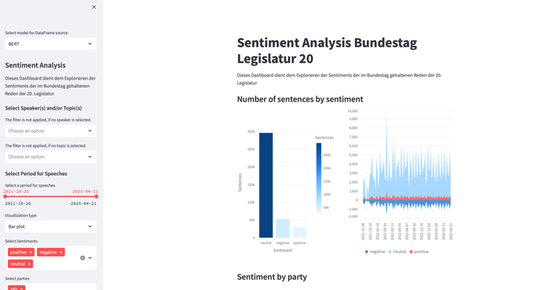
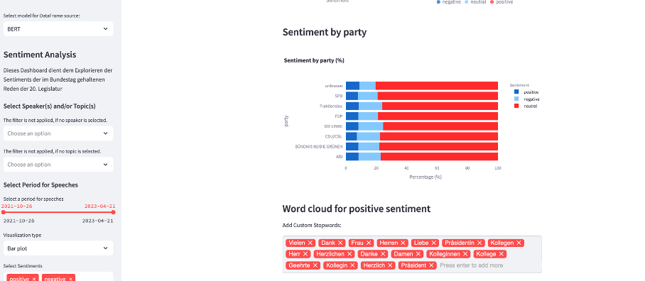
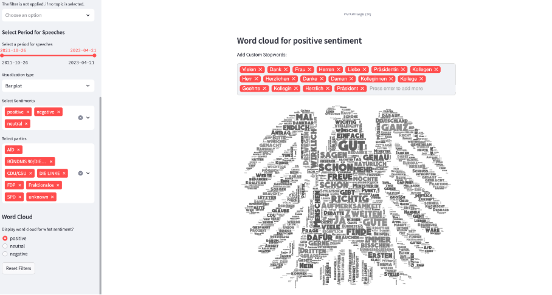
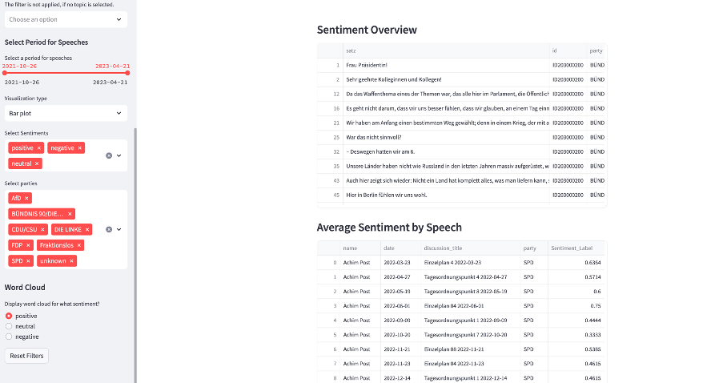

# Sentiment Analysis Dashboard



## Description
This application is a dashboard to explore the sentiments of speeches held in the Bundestag during the 20th legislative period. It provides detailed sentiment analysis results, graphical representations of sentiments distribution, and allows users to interactively filter and analyze specific datasets based on various criteria like speakers, topics, parties, and periods. Moreover, it gives a visually appealing representation of the most used words through word clouds per each sentiment category.

## Features
- **Sentiment Overview**: Visualizes sentiment analysis results and allows filtering based on various parameters.
- **Word Cloud**: Display the most used words in speeches per sentiment, allowing for the addition of custom stopwords.
- **Detailed Analysis**: Provides tables and charts to explore sentiment details related to politicians, discussions, parties, etc.
- **Interactivity**: Allows users to interactively explore the data by applying various filters and customizing visualization types.
- **Easy Navigation**: Facilitates navigation through sidebars and efficient data presentation in columns and sub-sections.






## Installation & Setup

### Prerequisites
Ensure you have the following installed:
- Python (3.7+)
- pip

### Dependencies
Install the required packages by running the following command:
\```bash
pip install streamlit pandas numpy nltk wordcloud matplotlib plotly pillow streamlit-tags
\```

### Running the App
Navigate to the directory containing `app.py` and execute the following command in your terminal:
\```bash
streamlit run app.py
\```
Now, the app should be running on your localhost. Open your web browser and go to `http://localhost:8501` to explore the dashboard!

## Usage
Navigate through the app using the sidebar and the various widgets. Select filters, visualize different plots, and explore the sentiments of speeches in detail:

- **Selections**: Use the sidebar for selections to choose models, speakers, topics, periods, visualization types, sentiments, and parties.
- **Word Cloud**: Select the sentiment for which you want to visualize a word cloud, add custom stop words if needed.
- **Filters**: Utilize text input fields to further filter speeches by politicians' names or discussion titles.
- **Reset Filters**: Use the "Reset Filters" button to clear all your current filter selections and view unfiltered data.
- **Visualizations**: View bar plots, pie charts, and area charts for an at-a-glance understanding of sentiment distributions.

## Contributing
If you'd like to contribute, please fork the repository and use a feature branch. Pull requests are warmly welcome.
