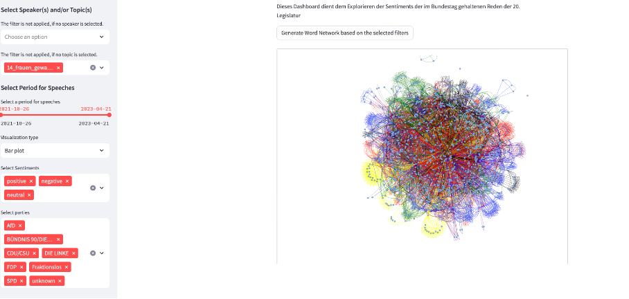

# Sentiment Analysis Dashboard / Word Network

## Overview

This Python script creates a Streamlit dashboard for exploring sentiments in the speeches held during the 20th legislative period of the German Bundestag. The dashboard provides options for filtering and visualization based on selected speakers, topics, time periods, sentiments, and parties. Additionally, it offers functionality for generating word networks based on focal terms and a single word filter.



## Functionality

- **Model Selection**: Choose a model (BERT, GPT) to determine the data source.
- **Filtering Options**: Filter speeches based on speakers, topics, date ranges, sentiments, and political parties.
- **Word Network**: Generate a visual word network based on focal terms and a single word filter. Edges can be optionally colorized based on party affiliation.
- **Data Caching**: Utilizes Streamlit's caching mechanism to optimize data loading.
- **Interactive UI**: Provides an interactive sidebar on the Streamlit app for user inputs.

## Prerequisites

### Libraries

Ensure the following Python libraries are installed:

```bash
pip install wordcloud streamlit pandas numpy plotly matplotlib nltk streamlit_tags spacy networkx pyvis requests
```

### Data Files

Make sure to have these data files:
- `processed_dataframe.csv`: Data for BERT model
- `processed_output_gpt.csv`: Data for GPT model
- `data/speeches_20.jsonl`: Raw speech data

### Natural Language Model

The German language model for Spacy should be installed:

```bash
python -m spacy download de_core_news_sm
```

## Usage

1. **Running the App**

   Run the Streamlit app with the following command:

   ```bash
   streamlit run [your_filename].py
   ```

2. **Exploring the Dashboard**

   - Use the sidebar for selecting a model for the data source and applying filters.
   - Explore the dashboard that updates based on filtering selections.
   - Generate a word network using selected filters and input words.

## Code Structure

- **Data Loading**: `load_data` function loads and caches data from the respective CSV file.
- **Data Filtering**: Applies multiple filters through multi-select and slider widgets.
- **Data Export**: Exports the filtered data to CSV.
- **Visualization**: Utilizes plotly, matplotlib, and pyvis for visualizations.
- **Network Graph**: Builds and visualizes a graph of words/terms showing relationships.
- **UI Components**: Uses Streamlit for rendering UI and enabling user interactivity.

## Notes

- Ensure working directories and file paths are correctly set.
- Ensure data files are well-structured and compatible with the script.
- Performance may vary based on data size and system capabilities.
